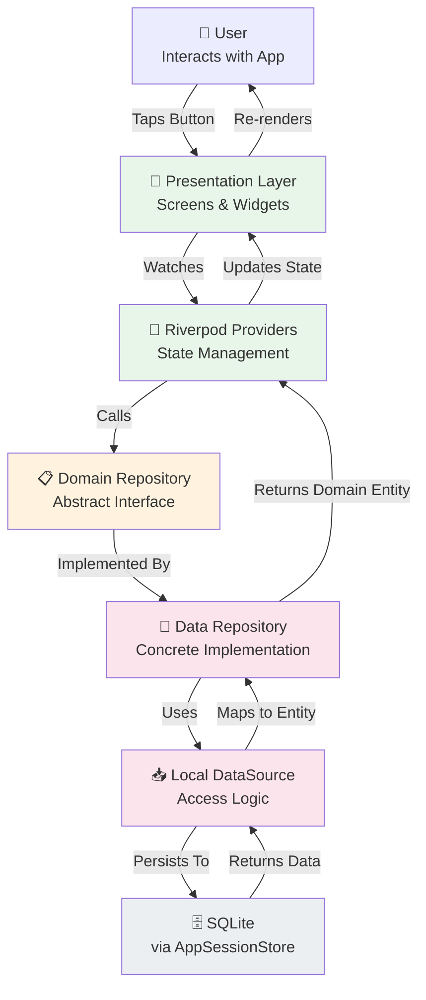
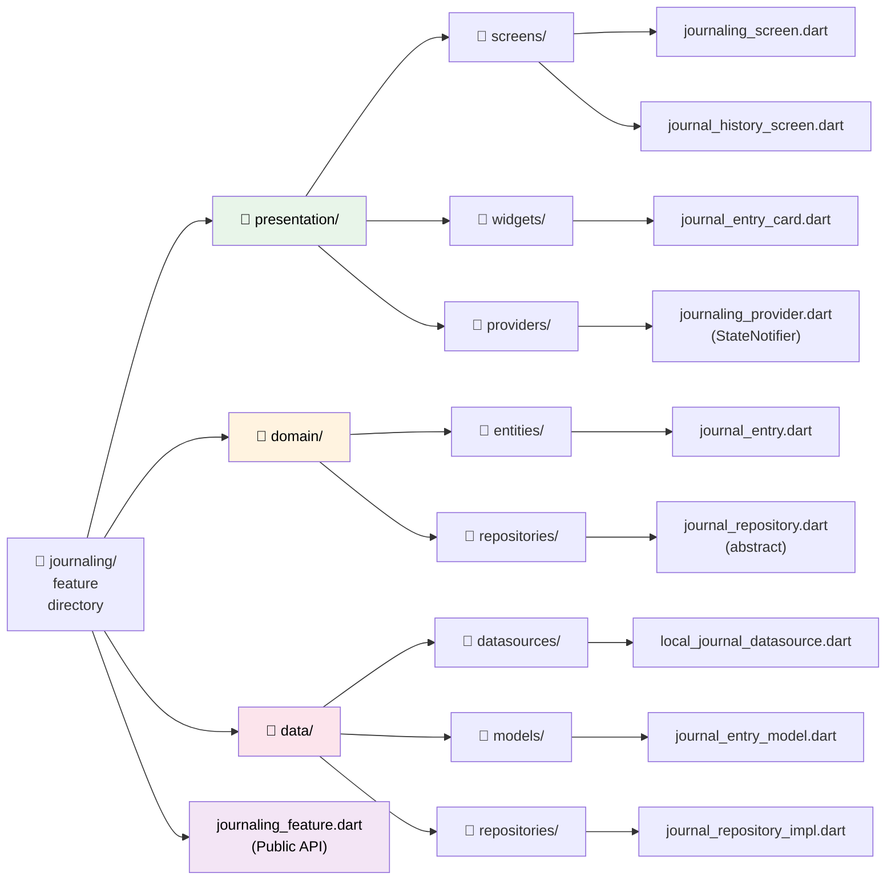
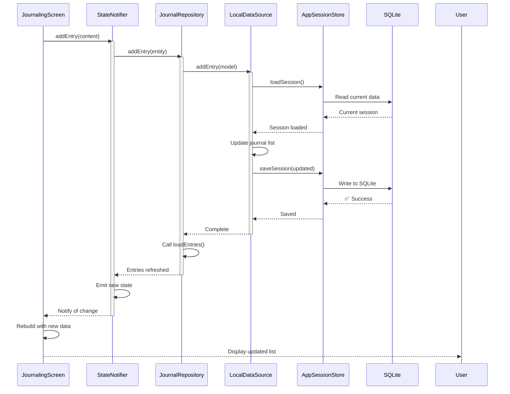
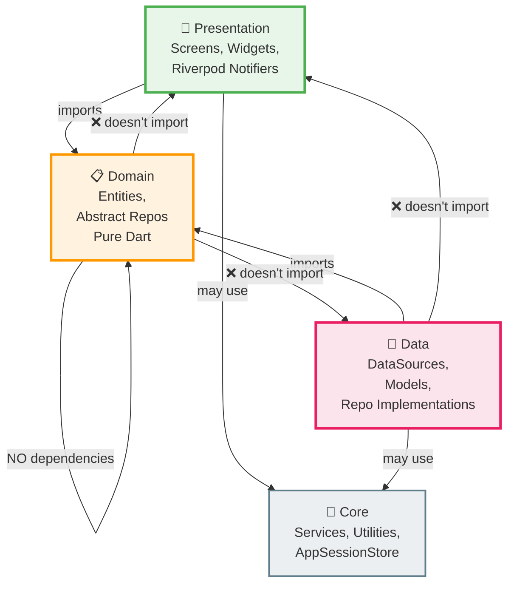
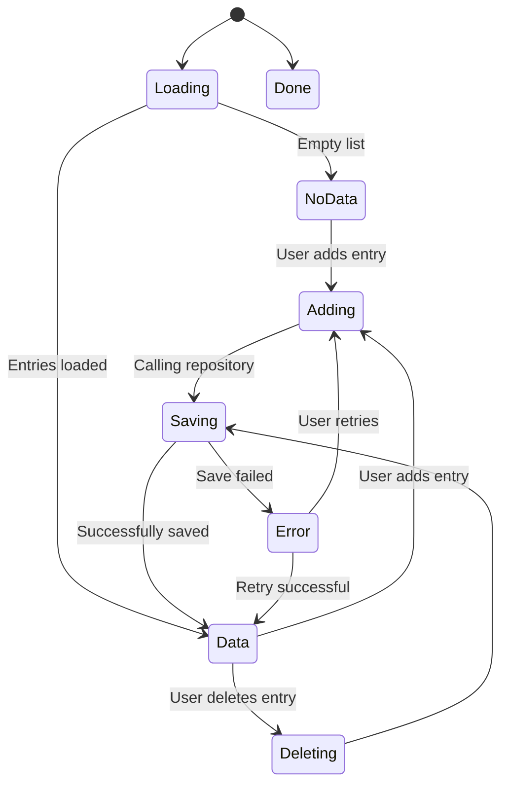
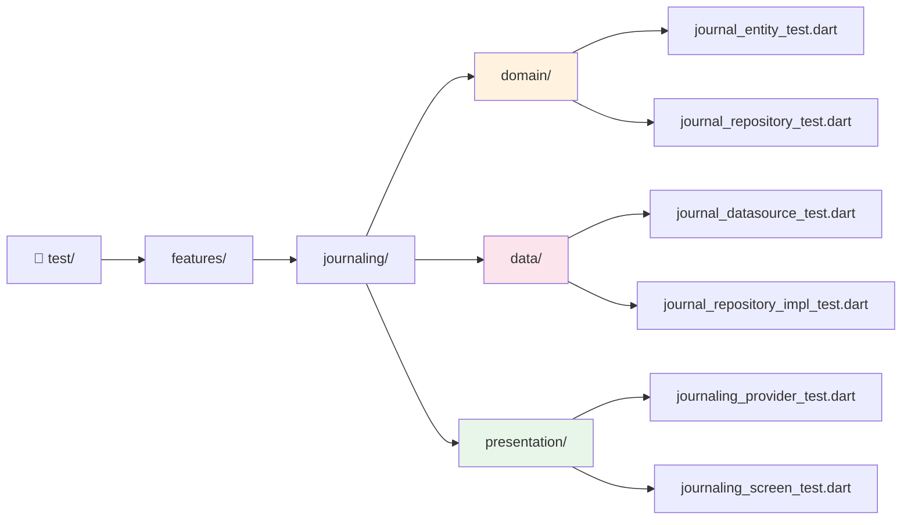

# Psychol Architecture - Complete Visual Guide

## System Architecture Diagram



## Feature Structure Example: Journaling



## Data Flow in Action: Adding a Journal Entry



## Layer Dependencies



## File Organization Pattern

```
lib/
├── features/                          ← All business features
│   ├── journaling/                    ✅ COMPLETE
│   │   ├── presentation/
│   │   │   ├── screens/
│   │   │   │   ├── journaling_screen.dart
│   │   │   │   └── journal_history_screen.dart
│   │   │   ├── widgets/
│   │   │   │   └── journal_entry_card.dart
│   │   │   └── providers/
│   │   │       └── journaling_provider.dart
│   │   ├── domain/
│   │   │   ├── entities/
│   │   │   │   └── journal_entry.dart
│   │   │   └── repositories/
│   │   │       └── journal_repository.dart
│   │   ├── data/
│   │   │   ├── datasources/
│   │   │   │   └── local_journal_datasource.dart
│   │   │   ├── models/
│   │   │   │   └── journal_entry_model.dart
│   │   │   └── repositories/
│   │   │       └── journal_repository_impl.dart
│   │   └── journaling_feature.dart     ← Public API
│   │
│   ├── mood_log/                      ✅ COMPLETE
│   │   ├── presentation/
│   │   ├── domain/
│   │   ├── data/
│   │   └── mood_log_feature.dart
│   │
│   ├── chat/                          📁 Ready
│   ├── appointments/                  📁 Ready
│   ├── settings/                      📁 Ready
│   └── ...9 more features...
│
├── core/                              ← Shared services
│   ├── theme/
│   ├── widgets/
│   └── services/
│       ├── app_session_store.dart     ← SQLite persistence
│       ├── ollama_service.dart
│       ├── nfc_service.dart
│       └── notification_service.dart
│
└── app/                               ← App-level setup
    ├── app_state.dart                 ← Central state (being refactored)
    ├── home_screen.dart
    └── theme_provider.dart
```

## State Flow Diagram



## Import Example: Using a Feature

```dart
// ✅ CORRECT: Import from feature's public API
import 'package:psychol/features/journaling/journaling_feature.dart';

// Use the feature
final entries = ref.watch(journalStateProvider);
final screen = JournalingScreen();
final entry = JournalEntry(
  createdAt: DateTime.now(),
  content: 'My thoughts...',
);

// ❌ WRONG: Don't import internal structure
import 'package:psychol/features/journaling/presentation/providers/journaling_provider.dart';
import 'package:psychol/features/journaling/data/repositories/journal_repository_impl.dart';
```

## Testing Structure (Future)



## Statistics

| Metric | Before | After |
|--------|--------|-------|
| Largest file | settings_screen.dart (1,175 lines) | Refactored into multiple 200-300 line files |
| Code organization | Monolithic by screen | Organized by layer + feature |
| Dependencies clarity | All mixed together | Clear unidirectional dependencies |
| Reusability | Low | High (widgets, logic extracted) |
| Testability | Difficult | Easy (domain logic isolated) |
| Maintainability | Hard to modify | Easy to modify |
| Scalability | Degrades with size | Scales linearly with new features |

## Transition Timeline

1. **Phase 1** ✅ (COMPLETE)
   - Created clean architecture pattern
   - Implemented journaling feature
   - Implemented mood_log feature
   - Created directories for all features
   - Documented patterns and templates

2. **Phase 2** (NEXT)
   - Implement chat, appointments, settings
   - Apply pattern to psychologists, dashboard
   - Complete remaining 7 features

3. **Phase 3** (FUTURE)
   - Add comprehensive test suite
   - Optimize AppSessionStore integration
   - Consider migrating from central AppSession to fully distributed state

---

## Key Takeaways

✅ **Clean Architecture Benefits**:
- Testable business logic (no UI dependencies)
- Easy to modify features independently
- Clear dependencies between layers
- Scalable pattern as app grows
- Easier onboarding for new developers

📚 **Reference Implementations**:
- [journaling](./lib/features/journaling/) - Full feature
- [mood_log](./lib/features/mood_log/) - Full feature

📖 **Documentation**:
- [ARCHITECTURE_OVERVIEW.md](./ARCHITECTURE_OVERVIEW.md) - Architecture explanation
- [ARCHITECTURE_REFACTORING.md](./ARCHITECTURE_REFACTORING.md) - Implementation guide
- [QUICK_REFERENCE.md](./QUICK_REFERENCE.md) - Quick lookup

🚀 **Next Step**: Pick a feature from remaining 10 and follow the templates!
